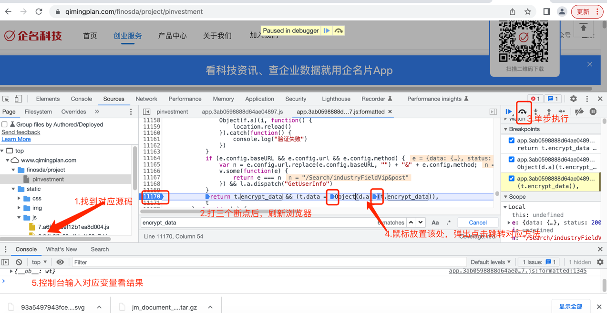

# 扣js代码

- 企名科技：https://www.qimingpian.com/finosda/project/pinvestment
    - 服务器返回的内容被加密：{"encrypt_data":"bOnqtWHqs4v..."}
    - 解决方法：模拟浏览器请求获取数据-->扣js解密代码-->解密
    - 扣js解密代码具体操作：
        - 浏览器调试工具：搜索关键词encrypt_data
        - 找到对应的js代码：app.3ab0598888d64ae04897.js
        - 在该js代码里检索关键词encrypt_data
        - 找到对应的解密函数："return t.encrypt_data && (t.data = Object(d.a)(t.encrypt_data))"
        - 解密函数为：Object(d.a)
        - 找到源码，打断点调试浏览器，在该处打断点，用鼠标放置在d.a处，弹出对应的方法点击跳转
        - 找到对应的js方法及其他内置方法，将方法扣下来
        - 运行example.js,测试，根据报错信息补充未定义的变量f、c
    - 通过python调用js代码：
    
    